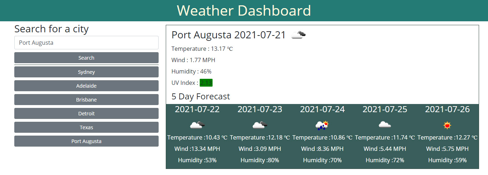
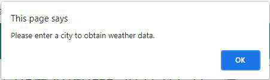
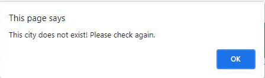

# Weather Dashboard
## Overview
This is a project carried out to create dashboard to display current and forecast weather data upto 5 days  for a given city. It is implemented by using HTML, CSS and jquery. Majority of the styles and layouts were done using the Bootstrap framework. Moment Javascript is used to manupulate the date and time when required.
Apart from that, an Openweather API was used to fetch data related to weather of a given city.

## Important Links
Refer to the following links:
* [Weather Dashboard - Deployed page](https://vish-opatha.github.io/weather-dashboard/)
* [Weather Dashboard - Github repository](https://github.com/vish-opatha/weather-dashboard)
## Mock-up
* This is the index page view.

* This is the message that will appear when the user tries search without entering a city.

* This is the message that will appear when the user tries to enter a non-existing city (example :xyz)

## Technical Acceptance - Work Done
1. User is given a place to provide an input for weather information.
2. User input is validated against empty values and they are formatted to camel case, no matter how the user enters them (Final output will be in camel case).
3. Once a proper input is received, the application connects with openweather API and fetch data related to current weather first which has temperature, wind, humidity, and the weather condition icon. Also it fetches latitude and longitude in order to fetch UV Index using a different querry.
4. Then UV Index is fetched and colour codes are defined to represent the severity of the index.
5. The given link was the reference to decide upon the color codes for UV Index !(https://www.verywellhealth.com/know-your-uv-index-1069524).
6. Apart from that, user is presented with 5 day weather forecast for the given city and data is fetched using a different endpoint. 
7. Current weather data and weather forecast data are only displayed when fetching is done properly.
8. All the data are stored in local storage and array format is used.
9. Buttons are created at each and every time when a user search for a new city at a given time, but buttons would not be redundant, if it is created in the search history before.
10. When the user clicks a city button that he/she has previously searched for then the user is presented with data local storage.
11. User alerts are included as per the requirement to educate the user.
## Deployment - Work Done
1. Application is deployed at live URL using Github pages, and the link is in the "Important links" section.
2. No errors were found in loading and executing the functions.
3. Link to the Github URL is given and the repository and it contains the complete code.
## Application Quality - Work Done
1. Deployed page resembles the mock-up in design and functionality.
2. Deployed page is easy to understand and navigate.
3. Application is designed in a way that it behaves responsively.
## Repository Quality - Work Done
1. Repository is named as weather-dashboard.
2. Regarding the folder structure, "Assets" includes separate folders for images,CSS and javascript.
4. Tags are indented accordingly and comments are included while following the best practices for naming conventions.
5. Changes were committed multiple times with messages.

- - -
📝 Created by Vish Opatha (Last updated on 21 July 2021).

